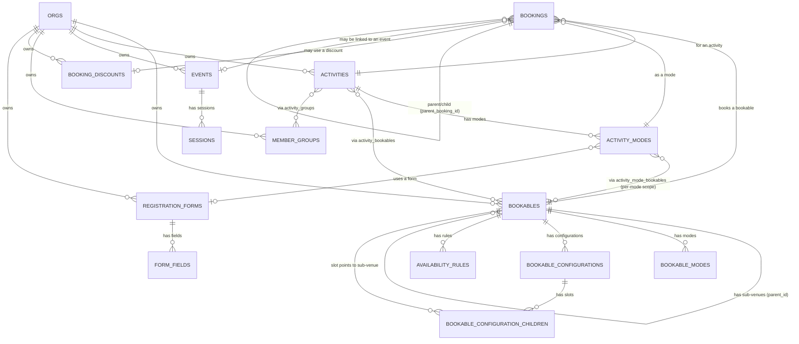

# FriendlyManager Events — Developer Handoff

> **Purpose:** This is a living document. A developer who has never seen this codebase should be able to read this and rebuild the product from scratch. Every page, every rule, every database table is here. Plain English. No jargon without explanation.
>
> **Last updated:** 2026-05-02
> **Maintained by:** Karl Friend (karl@getfrello.com)
> **Source code:** `/Users/karl/fm-events/`
> **Screenshots folder:** `docs/screenshots/` — regenerate with `npm run docs:capture`

---

## Table of Contents

1. [What this product is](#1-what-this-product-is)
2. [Who uses it](#2-who-uses-it)
3. [Tech stack at a glance](#3-tech-stack-at-a-glance)
4. [Glossary — words you need to know](#4-glossary--words-you-need-to-know)
5. [Database overview & diagram](#5-database-overview--diagram)
6. [Page-by-page guide](#6-page-by-page-guide)
   - 6.1 [Login `/login`](#61-login-login)
   - 6.2 [Events list `/events`](#62-events-list-events)
   - 6.3 [Create basic event `/events/new-basic`](#63-create-basic-event-eventsnew-basic)
   - 6.4 [Create advanced event `/events/new-advanced`](#64-create-advanced-event-eventsnew-advanced)
   - 6.5 [Create multi-event `/events/new-multi`](#65-create-multi-event-eventsnew-multi)
   - 6.6 [Event reporting `/events/reporting`](#66-event-reporting-eventsreporting)
   - 6.7 [Event detail `/events/:id`](#67-event-detail-eventsid)
   - 6.8 [Bookables hub `/bookables`](#68-bookables-hub-bookables)
   - 6.9 [Bookable (venue) detail `/bookables/:id`](#69-bookable-venue-detail-bookablesid)
   - 6.10 [Activity detail `/activities/:id`](#610-activity-detail-activitiesid)
   - 6.11 [Activity mode editor `/activities/:id/modes/:modeId`](#611-activity-mode-editor-activitiesidmodesmodeid)
   - 6.12 [Booking wizard — staff `/bookings/new`](#612-booking-wizard--staff-bookingsnew)
   - 6.13 [Booking wizard — public `/book`](#613-booking-wizard--public-book)
   - 6.13b [Scheduler view (right-rail state machine)](#613b-scheduler-view-right-rail-state-machine)
   - 6.14 [Booking confirmation `/booking/:ref`](#614-booking-confirmation-bookingref)
   - 6.15 [Pending bookings `/bookings/pending`](#615-pending-bookings-bookingspending)
   - 6.16 [Forms list `/forms`](#616-forms-list-forms)
   - 6.17 [Form builder `/forms/:id`](#617-form-builder-formsid)
   - 6.18 [Settings `/settings`](#618-settings-settings)
   - 6.18a [Roles `/settings/roles`](#618a-roles-settingsroles)
   - 6.19 [Calendar settings `/settings/calendars`](#619-calendar-settings-settingscalendars)
   - 6.20 [Venues settings `/settings/venues`](#620-venues-settings-settingsvenues)
   - 6.21 [Finances `/finances`](#621-finances-finances)
   - 6.22 [Reporting `/reporting`](#622-reporting-reporting)
   - 6.23 [Registration `/registration`](#623-registration-registration)
   - 6.24 [People `/people`](#624-people-people)
   - 6.25 [Person profile `/people/:id`](#625-person-profile-peopleid)
   - 6.26 [My family & circles `/account/profiles`](#626-my-family--circles-accountprofiles)
7. [Cross-cutting rules](#7-cross-cutting-rules)
8. [Business rules reference](#8-business-rules-reference)
9. [How to keep this document up to date](#9-how-to-keep-this-document-up-to-date)

---

## 1. What this product is

**FriendlyManager Events** is software for sports clubs and national sports organisations (NSOs). It does two big jobs:

1. **Run events.** Things like "Saturday Junior Tournament" or "Tuesday Night Coaching". Each event has a date, a place, attendees, fees, and a registration form.
2. **Take bookings.** People (members or the public) can book a tennis court, a coaching session, a meeting room, or a piece of equipment for a slot of time.

Everything lives inside an **organisation** (e.g. "Smithtown Tennis Club"). One organisation can have many staff members, many venues, many activities, and many events.

### Why it exists
Sports clubs currently glue together spreadsheets, paper diaries, third-party ticket sites, and accounting tools. This product replaces all of that with one connected system.

### Big design rules
- **Mobile and desktop both matter.** Members register on phones, staff manage on laptops.
- **Public-facing pages must work for someone who isn't logged in.** `/book` and the registration form pages are public.
- **Multi-tenant.** Every row in every database table belongs to one organisation. Queries always filter by `org_id`.

---

## 2. Who uses it

| Person | What they do | Where they spend time |
|---|---|---|
| **Org admin** (club manager) | Sets up the club, venues, activities, fees, members | `/settings`, `/bookables`, `/activities` |
| **Staff** (coach, booking officer) | Creates events, takes bookings on behalf of members, manages attendance | `/events`, `/bookings/new`, `/events/:id` |
| **Member** (a logged-in club member) | Books a court, registers for an event, sees their schedule | `/book`, registration form pages |
| **Public visitor** | Books a session without having an account | `/book`, `/booking/:ref` |

---

## 3. Tech stack at a glance

| Layer | What we use |
|---|---|
| Framework | **Nuxt 3** (Vue 3 under the hood) — file-based routing, `ssr: false` |
| Language | **TypeScript** everywhere |
| UI library | **PrimeVue v4** (InputText, Select, ToggleSwitch, DataTable, etc.) |
| Styling | **Tailwind CSS v3** + `tailwindcss-primeui` plugin |
| Brand colour | `#1E2157` — Tailwind class `bg-primary` / `text-primary` |
| Database | **Supabase** (PostgreSQL + auth + file storage) |
| Server-side talking-to-the-DB | A wrapper called `useDb()` (admin client) |
| Testing | Playwright (`tests/uat.spec.ts`) |

### Code patterns to know
- **Always use `useDb()`** to talk to the database. Never `useSupabaseClient()` directly.
- **Always scope to `orgId`.** Get it via `const { orgId } = useOrg()`.
- **Inline event handlers don't accept TypeScript or `if`.** Use a named method or a ternary.
- **Settings rows** use `<AppCard>` + `<SettingsRow label description>`.

---

## 4. Glossary — words you need to know

This product has its own vocabulary. Learn these or you'll get lost.

| Word | Plain meaning |
|---|---|
| **Organisation (org)** | One club. The whole product is multi-tenant — every record belongs to an org. |
| **Bookable** | A thing that can be booked. Could be a tennis court, a meeting room, a piece of equipment. Bookables can have child bookables (Court 1 → Half A, Half B). |
| **Sub-venue** | A bookable that lives inside another bookable. Half A is a sub-venue of Court 1. Court 1 is a sub-venue of "Tennis Courts". |
| **Activity** | The thing a person actually wants to do — "Tennis", "Squash", "Yoga". Activities link to bookables (you can play tennis on Court 1, 2, 3, 4). |
| **Mode** | A specific way to do an activity — "Singles", "Doubles", "Junior coaching". Each mode has its own price and rules. |
| **Configuration** | A named way of slicing up a venue. Court 1 has a "Halves" configuration (2 slots) and a "Quarters" configuration (4 slots). |
| **Slot** | One pickable space inside a configuration. The "Halves" config has 2 slots. Each slot can list multiple sub-venues that get booked together (Half A = {Q1, Q2}). |
| **Booking** | A reservation. One row in the `bookings` table = one block of time on one bookable. A multi-slot booking writes one parent + child rows that share `parent_booking_id`. |
| **Event** | A scheduled thing with attendees — tournament, training session, meeting. Has sessions (one or many), fees, a form, and invitees. |
| **Session** | One time-slot of an event. A weekend tournament might have 6 sessions (3 per day). |
| **Form** | A registration form (name, email, etc.). Stored in `registration_forms` + `form_fields`. Can be reused across events and activity modes. |
| **Member group** | A category of members (e.g. "Juniors", "Seniors"). Used for pricing tiers and access control. |

---

## 5. Database overview & diagram

The database is **PostgreSQL on Supabase**. Migrations live in `/supabase/migrations/` and are numbered (currently up to `115_`). Apply them with `npx supabase db push`.

### Top-level relationship diagram



### Key tables — what each is for

| Table | What it stores |
|---|---|
| `orgs` | One row per organisation. The tenant boundary. |
| `org_members` | Who is in which org and what role they have. |
| `bookables` | Venues, rooms, courts, equipment. Self-referential: `parent_id` builds the tree. `master_id` links siblings (Court 2 inherits from Court 1). |
| `bookable_modes` | Old-style booking modes attached directly to a bookable. Mostly superseded by activity modes. |
| `bookable_configurations` | Named layouts on a parent venue. E.g. Court 1 has "Halves" and "Quarters". |
| `bookable_configuration_children` | The slots inside a configuration. `slot_index` + `slot_name`. A slot can list multiple sub-venues that get booked together. |
| `availability_rules` | When a bookable is open/closed. Days of week, time windows, date ranges. |
| `activities` | "Tennis", "Squash", etc. Has a `booking_flow` column: `'wizard'` or `'scheduler'`. |
| `activity_modes` | "Singles", "Doubles", "Coaching" — under an activity. Has pricing, add-ons, a form, a `configuration_key` (which configuration on the parent venue this mode requires). |
| `activity_bookables` | Many-to-many: which activities can happen on which bookables. |
| `activity_mode_bookables` | Per-mode narrowing — "this mode only on these specific bookables". Empty = uses all activity bookables. |
| `activity_groups` | Which member groups can use which activities. |
| `events` | Tournaments, sessions, meetings. Has a name, date range, status, banner, sponsors. |
| `sessions` | One time-slot of an event. Fees, add-ons, capacity all live here. |
| `bookings` | Actual reservations. `parent_booking_id` (self-FK) groups multi-bookable atomic reservations. |
| `booking_discounts` | Discount codes/rules applied to bookings. |
| `booking_discount_activities` / `..._modes` | Scope a discount to certain activities or modes. |
| `member_groups` | "Juniors", "Seniors", "Coaches" etc. Drives pricing tiers and access. |
| `circles` | Connections between people. `kind` = `family` (guardians + dependents) or `circle` (peer group). A family is a circle with `kind='family'`. Customisable `name`, `color` (background tint) and `image_url` (picture). |
| `circle_members` | Who's in a circle, their `role` (guardian/dependent/member), whether they're a circle `is_lead`, and what they can do (`can_book_for`, `can_register`, `can_view`). For contacts (family members): `relationship`, `is_primary`, `receives_comms`. Guardians manage dependents; circle members never manage profiles. |
| `comms_preferences` | Per `(recipient person, subject person)` pair: which message categories the recipient wants on that person's behalf. No row = all. Set from the Family & Circles "Communications on your behalf" dropdown. |
| `registration_forms` + `form_fields` | Reusable forms used by events and activity modes. |
| `bank_accounts` | Org-level bank account details for invoice payments. |
| `doors` | Physical access points (gates, locks). Hardware provider + ID for vendor integration. |
| `light_zones` | Controllable lighting groups (LED zones, dimmer circuits). |
| `bookable_doors` / `bookable_light_zones` | Which doors / light zones are connected to a venue. |
| `physical_schedules` | Auto-generated unlock + lighting windows per booking. One row per door (or light zone) per booking. `delivered_at` tracks when a worker pushes the command to vendor hardware (post-prototype). |
| `access_scans` | Log of badge taps / code attempts. `result` is `GRANT`/`DENY`/`UNKNOWN`. |

### Recent migrations worth knowing
- `177_person_comms_topics.sql` — `persons.comms_topics` — which club communications a person is subscribed to (the required "Communication" profile field).
- `176_contact_type.sql` — a contact has a **Type** (Primary / Standard / Emergency / Contact), chosen from a dropdown column, separate from their relationship label.
- `175_contacts.sql` — **"Family" reframed as Contacts.** Adds `circle_members.relationship`, `is_primary` and `receives_comms`. The profile tab is now **"Contacts & Circles"**: a tidy column-aligned table of a person's contacts (Contact · Relationship · Type · Receives comms), where ticking "receives comms" reveals a **Customise** link to pick which email types they get. Contacts are stored as members of the person's family circle.
- `174_comms_preferences.sql` — **choosing which comms you get on someone's behalf.** A guardian who receives a dependent's messages can pick which *categories* they want (Events, Payments, Attendance, Results, General) — stored in `comms_preferences`. No row = they get everything. Set via a dropdown per dependent on the Family & Circles view. (The actual sending isn't wired to it yet — it captures the preference.)
- `173_circle_image.sql` — circles get a **picture** (`image_url`), alongside the name and background colour. Set inline on the Family & Circles cards.
- `172_person_types_multi.sql` — **multi-role people.** A person can now hold several types/roles at once (Member + Coach + Parent…) via `persons.person_types[]`. The single `person_type` is kept as the *primary* role (`person_types[0]`) so the designed profile layout and dashboard still work. The profile's "Type" field is now a **"Roles" multi-select**, and the People list shows a tag per role and filters by any role.
- `171_circles_phase2.sql` — **Families & Circles, Phase 2 (act on behalf).** Adds `bookings.subject_person_id` (who a booking is *for*, vs the contact who made it), `circles.color`, `circle_members.is_lead` (circle "leads"), and `circle_members.can_register` (permission to sign a member up to events, separate from booking). The "How would you like to book?" screen now asks signed-in members **"Who is this for?"** when they can act for someone (a child or a circle co-member), and the choice is stamped on the booking / pre-fills the registration. Financials (paying / renewing on behalf) are deliberately still out of scope.
- `170_circles.sql` — **Families & Circles** (connecting people). Adds `circles` (`name`, `kind` = family or circle) and `circle_members` (`role`, `can_book_for`, `can_view`). A family is just a circle with `kind='family'`; a child in two families = split household. Guardians manage their dependents; circle members can act on each other's behalf but never edit profiles. Powers the `/people/:id` Family & Circles tab and `/account/profiles`.
- `108_activity_mode_bookables.sql` — per-mode bookable scope.
- `109_bookable_configurations.sql` — configurations + slot model + `activity_modes.configuration_key`.
- `110_configuration_slots.sql` — multi-member slots like "Half A = Q1+Q2".
- `111_booking_parent_link.sql` — `bookings.parent_booking_id` for atomic multi-bookable reservations.
- `113_auto_resolve_children.sql` — `bookables.auto_resolve_children` — lets the system pick a child bookable at booking time instead of asking the user.
- `114_activity_mode_display.sql` — display options for activity modes.
- `115_org_booker_theme.sql` — per-org theme for the public booking widget.
- `124_access_control.sql` — physical access. Drops the unused profile abstraction, adds first-class `doors` and `light_zones` tables, joins them to bookables, adds per-venue settings (`access_enabled`, code length + delivery, unlock window, lighting ramp + level), adds `bookings.access_code` + `access_code_delivered_at`, recreates `physical_schedules` keyed to a door OR light zone (not both). The `/api/finalize-access` endpoint generates the code, materialises the schedule rows, and emails the booker — called from every booking insert path when the booking is CONFIRMED.

---

## 6. Page-by-page guide

Every page lists:
- **URL** — the route(s) that show this page.
- **Source file** — where the code lives.
- **Screenshot** — image in `docs/screenshots/`.
- **What this page is for** — plain English.
- **What the user can do** — interactions.
- **Rules** — important guardrails.
- **Database** — which tables it reads/writes.
- **Linked pages** — where you can go from here.

---

### 6.1 Login `/login`

- **URL:** `/login`
- **Source:** `pages/login.vue`
- **Screenshot:** `docs/screenshots/login.png`

**What this page is for**
The front door. A user types their email and password, and we let them into the app.

**What the user can do**
- Sign in with email + password.
- Click "Forgot password?" to start a reset.
- Click "Sign up" if they don't have an account.

**Rules**
- Uses `useSupabaseClient()` directly (this is the one place that's allowed — most pages use `useDb()`).
- After successful login, redirect to `/events`.
- Form validation: email must be a real email, password can't be empty.

**Database** — none directly; Supabase Auth handles the user record.

**Linked pages** — `/events` (after login).

---

### 6.2 Events list `/events`

- **URL:** `/events`
- **Source:** `pages/events/index.vue`
- **Screenshot:** `docs/screenshots/events.png`

**What this page is for**
The main events dashboard. Staff see every event their organisation has.

**What the user can do**
- See events in a **list** or a **calendar** (toggle in the toolbar).
- Search by event name.
- Filter by status (upcoming, past, draft, cancelled).
- Click "+ New event" to create one (opens a chooser for basic / advanced / multi).
- Click any row to open the event detail page.

**Rules**
- Events are scoped to `orgId` — only the current org's events show.
- Default sort: upcoming first, by start date.
- Cancelled events are hidden by default.

**Database** — reads `events` (joined with `sessions` for date ranges).

**Linked pages** — `/events/new`, `/events/:id`, `/events/reporting`.

---

### 6.3 Create basic event `/events/new-basic`

- **URL:** `/events/new-basic`
- **Source:** `pages/events/new-basic.vue`
- **Screenshot:** `docs/screenshots/events-new-basic.png`

**What this page is for**
A simple, single-step form to create one event with one session. For when you don't need anything fancy.

**What the user can do**
- Type a name, pick a date and time.
- Pick a location.
- Set capacity.
- Hit "Create".

**Rules**
- Inserts one row in `events` and one row in `sessions`.
- Defaults: status = `'draft'`, capacity = unlimited.
- Redirects to `/events/:id` on success.

**Database** — writes `events`, `sessions`.

---

### 6.4 Create advanced event `/events/new-advanced`

- **URL:** `/events/new-advanced`
- **Source:** `pages/events/new-advanced.vue`
- **Screenshot:** `docs/screenshots/events-new-advanced.png`

**What this page is for**
A multi-step wizard for events with several sessions, repeating dates, complex fees, or invitee groups.

**What the user can do**
- Step through: Details → Programme dates → Sessions → Fees → Invitees → Review.
- The Sessions step uses `<BulkSessionTemplates>` to generate sessions across the programme days (e.g. "every Tuesday and Thursday for 6 weeks").

**Rules**
- Each step validates before letting you go to the next.
- "Save as draft" is available on every step.

**Database** — writes `events`, `sessions`, optionally event-invitee join tables.

---

### 6.5 Create multi-event `/events/new-multi`

- **URL:** `/events/new-multi`
- **Source:** `pages/events/new-multi.vue`
- **Screenshot:** `docs/screenshots/events-new-multi.png`

**What this page is for**
Bulk-create many separate events from a template. Useful for e.g. "create 8 weekly tournaments, one per Saturday".

**What the user can do**
- Define one template event.
- Pick how many copies, with a date pattern.
- Preview the full list, then bulk-create.

**Database** — writes many rows to `events` + `sessions`.

---

### 6.6 Event reporting `/events/reporting`

- **URL:** `/events/reporting`
- **Source:** `pages/events/reporting.vue`
- **Screenshot:** `docs/screenshots/events-reporting.png`

**What this page is for**
Cross-event analytics — how many events ran, how many attendees, total revenue, average fill rate.

**What the user can do**
- Pick a date range.
- See KPI cards.
- See charts: events over time, revenue by activity, attendance trends.

**Database** — reads `events`, `sessions`, `bookings` (aggregated).

---

### 6.7 Event detail `/events/:id`

- **URL:** `/events/:id`
- **Source:** `pages/events/[id].vue` (~8230 lines — the largest single file)
- **Screenshot:** `docs/screenshots/event-detail.png`

**What this page is for**
The cockpit for managing one event. Has many tabs along the top.

**Tabs and what each does**

| Tab | Screenshot | What it does |
|---|---|---|
| **Overview** | `event-detail-tab-overview.png` | Summary card, quick stats, hero image |
| **Sessions** | _(in `event-detail.png`)_ | List + inline editor for each session — dates, fees, add-ons, capacity. Uses `<SessionEditor>`. |
| **Invitees** | `event-detail-tab-invitees.png` | Add/remove invitees, by group or individual. Uses `<EventInviteeManager>` and `<InviteeGroupPicker>`. |
| **Forms** | _(in `event-detail.png`)_ | The registration form for this event. Right-rail design panel (`<EventFormDesignPanel>`) controls audience, header image, info icons, sponsors. Field area uses `<FormFieldCanvas>`. |
| **Discounts** | _(inline)_ | Discount codes specific to this event. |
| **Tickets** | _(inline)_ | Ticket types — name, price, quantity, sale window. |
| **Communication** | `event-detail-tab-comms.png` | Send emails / notifications to attendees. |
| **Automation** | _(inline)_ | Rules that fire on event milestones (e.g. "send reminder 24h before"). |
| **Attendance** | `event-detail-tab-attendance.png` | Mark attendees as present/absent on the day. |
| **Notes & Tasks** | `event-detail-tab-notes-tasks.png` | Internal notes and to-dos for this event. |

**Rules**
- Tab state lives in the URL (`?tab=sessions`) so refresh keeps you on the same tab.
- Direct URL navigation must trigger tab loads in `onMounted`, **not** in `watch(activeTab)` (Vue's `watch` skips the initial value).
- Sessions inherit fee defaults from the event but can override per-session.

**Database** — reads `events`, `sessions`, `bookings` (linked via `event_id`), `registration_forms`, `form_fields`, plus a wide range of join tables for invitees and discounts.

**Linked pages** — `/forms/:id` (form builder), `/bookings/new` (when staff link a booking to this event).

---

### 6.8 Bookables hub `/bookables`

- **URL:** `/bookables` (with `?tab=` to deep-link a tab)
- **Source:** `pages/bookables/index.vue`
- **Screenshot:** `docs/screenshots/bookables.png`

**What this page is for**
The top-level hub for everything a club books — venues, activities, recent bookings, discount rules, access controls. One page, several pill tabs at the top.

**Tabs**

| Tab | Screenshot | Component | What it shows |
|---|---|---|---|
| **Bookings** | `bookables-bookings.png` | `<BookingsList>` | Recent + upcoming bookings across the org. Hidden when no active bookables exist. |
| **Bookables** | `bookables.png` | `<BookablesList>` | Venues, persons, items. Sub-tabs inside: **Venues**, **Persons**, **Items**, **Archived** (only shown when archived count > 0). Venues view groups each top-level facility into its own card; depth-0 expanded by default. |
| **Activities** | `bookables-activities.png` | `<ActivitiesList>` | List of all activities in the org. |
| **Discounts** | `bookables-discounts.png` | `<BookingDiscountsList>` | Booking-time discount codes/rules. |
| **Access** | `bookables-access.png` | `<AccessControlList>` | Org-wide catalogue of physical doors and light zones. Two inner tabs: **Doors** (gates, magnetic locks, smart locks) and **Lights** (LED zones / dimmer circuits). Each row carries a hardware provider + ID for vendor integration. Rows here become pickable on a venue's Access tab. |

**What the user can do**
- Click "Set up a sport" in the toolbar (or empty state) → opens `<SetupWizard>`. The wizard creates a top-level facility, child courts, configurations, an activity with modes, and all the joins, in one shot.
- Click any venue/activity row to open its detail page.
- Add a venue, sub-venue, or item.

**Rules**
- "+ New venue" doesn't open a separate page — it inserts a draft `bookables` row and redirects to `/bookables/:id?new=1` so the Details tab opens.
- Adding a sub-venue uses `createChildBookable()` which goes through the same flow.

**Database** — reads `bookables`, `activities`, `bookings`, `booking_discounts`, plus join tables.

**Linked pages** — `/bookables/:id`, `/activities/:id`, `/bookings/new`.

---

### 6.9 Bookable (venue) detail `/bookables/:id`

- **URL:** `/bookables/:id` (with `?tab=` to deep-link a tab)
- **Source:** `pages/bookables/[id].vue` (~2160 lines)
- **Screenshot:** `docs/screenshots/bookable-detail.png`

**What this page is for**
Edit one venue (or sub-venue, or item). Wraps `<BookableEditor>` plus extra tabs.

**Tabs**

| Tab | Screenshot | What it does | Tables touched |
|---|---|---|---|
| **Bookings** | `bookable-detail-bookings.png` | Calendar of bookings for this venue. Uses `<BookingsCalendar>`. | `bookings` |
| **Details** | `bookable-detail-details.png` | Info, modes, activities, rules, images. Uses `<BookableEditor>` (which has its own internal sub-tabs). | `bookables`, `bookable_modes` |
| **Availability** | `bookable-detail-availability.png` | Drag-to-set availability calendar. Uses `<AvailabilityEditor>`. Each rule has a date range + days + time window. | `availability_rules` |
| **Sub-venues** | _(in `bookable-detail.png`)_ | Visual venue map with click-to-select tiles + Configurations panel below. New sub-venue uses `<VenueLibraryDialog>` for first add. | `bookables`, `bookable_configurations`, `bookable_configuration_children` |
| **Items** | `bookable-detail-items.png` | Items/equipment associated with this venue. | `bookable_items` |
| **Access** | _(no screenshot yet)_ | Hook this venue up to physical doors + lights. Master toggle, door multi-select, light multi-select, code-delivery channel, unlock-window minutes, lighting ramp + level. Bookings on the venue auto-generate an access code and an unlock schedule. | `bookables` (access_*), `bookable_doors`, `bookable_light_zones` |

**Inside the Details tab — `<BookableEditor>` sub-tabs**

| Sub-tab | What it edits |
|---|---|
| Details | Name, description, location, features |
| Modes | Booking modes (the old direct-on-bookable kind) |
| Activities | Linked activities (writes `activity_bookables`) |
| Rules | Max concurrent, booking limits, "disallow concurrent / consecutive" toggles, rules notes |
| Images | Photos — `bookables.images`, `bookables.main_image` |

**Sub-venues tab — important model**

A parent venue (e.g. "Tennis Courts") contains child courts. Each court can be sliced different ways for different uses:
- Tennis Court 1 is one bookable.
- It has child sub-venues for Q1, Q2, Q3, Q4 (the **finest** division — only the finest level lives as real `bookables` rows).
- It also has **configurations**:
  - "Quarters" config → 4 slots, each one quarter.
  - "Halves" config → 2 slots; Half A = {Q1, Q2}, Half B = {Q3, Q4}.

When someone books "Half A", the system writes one parent booking on Q1 and one child booking on Q2 — both calendars show busy.

**Rules**
- Layouts are gone. The old `bookable_layouts` table was dropped in migration 107. Use sub-venues + configurations instead.
- "+ New configuration from selection" pre-fills the dialog with one slot containing the tiles you clicked.
- A bookable's `auto_resolve_children` flag controls whether the booker shows children as separate columns or lets the system pick a child at booking time.

**Database** — heavy: `bookables`, `bookable_modes`, `bookable_configurations`, `bookable_configuration_children`, `availability_rules`, `bookings`.

**Linked pages** — `/activities/:id`, `/bookings/new` (with this bookable preselected).

---

### 6.10 Activity detail `/activities/:id`

- **URL:** `/activities/:id`
- **Source:** `pages/activities/[id]/index.vue` (~720 lines)
- **Screenshot:** `docs/screenshots/activity-detail.png`

**What this page is for**
Edit one activity ("Tennis", "Coaching", etc.). Two-column body, no top tabs — everything visible at once.

**Left column**
- **Details card** — name, description, colour, status, "Bookings enabled" toggle, area name (singular/plural), image upload.
- **Venues card** — which bookables this activity can run on (writes `activity_bookables`).
- **Booking link card** — the public URL for this activity (`/book?org=…&activity=…`).
- **Groups card** — which member groups can do this activity (writes `activity_groups`).
- **Booking settings card** — approval mode, advance window, min notice, cancellation window, min/max duration, buffer time. Plus "Booking behaviour" toggles.

**Right column**
- **Modes table** — every mode under this activity. Click a row to open the mode editor.

**Rules**
- Back button goes to `/bookables?tab=activities`.
- `booking_flow` is `'wizard'` (default) or `'scheduler'`. This decides which UI the booker sees:
  - `'wizard'` → multi-step `<BookingWizard>`.
  - `'scheduler'` → single-screen `<BookingScheduler>` (slot-aware, used for clubs with complex venue layouts).

**Database** — `activities`, `activity_modes`, `activity_bookables`, `activity_groups`.

---

### 6.11 Activity mode editor `/activities/:id/modes/:modeId`

- **URLs:** `/activities/:id/modes/new` (new) and `/activities/:id/modes/:modeId` (edit)
- **Source:** `pages/activities/[id]/modes/[modeId].vue` (~697 lines)
- **Screenshots:** `mode-editor.png`, `mode-editor-tab-details.png`, `mode-editor-tab-pricing.png`, `mode-editor-tab-bookings.png` (and the `-new-` variants)

**What this page is for**
Edit one mode of one activity. E.g. "Singles" under "Tennis", or "Junior Coaching" under "Coaching".

**Tabs**

| Tab | What it edits |
|---|---|
| **Details** | Name, colour, image, **Capacity** card (incl. "Allow visitors" toggle), **Required configuration** picker, **Bookable scope** card |
| **Pricing** | Default pricing + per-tier overrides. Uses `<ModePricingTiersEditor>`. |
| **Add-ons** | Optional extras (extra ball machine hire, locker, etc.). Uses `<ModeAddonsEditor>`. |

**Required configuration picker**
- Binds to `activity_modes.configuration_key`.
- Dropdown is built by deduping `bookable_configurations.key` across the activity's linked bookables.
- This tells the booker which configuration of the parent venue this mode needs (e.g. "Singles" → "Halves").

**Bookable scope card**
- Writes `activity_mode_bookables`.
- Empty list = "use all bookables this activity is on".
- Non-empty = narrow to just these bookables.

**Pricing**
- Default pricing is the fallback.
- Per-tier overrides let "Juniors" pay less than "Adults" (tiers come from `member_groups`).

**Database** — `activity_modes`, `activity_mode_bookables`, `bookable_configurations` (read-only, for the picker).

---

### 6.12 Booking wizard — staff `/bookings/new`

- **URL:** `/bookings/new`
- **Source:** `pages/bookings/new.vue` (6 lines — thin wrapper) → `<BookingWizard staff />`
- **Screenshots:** `bookings-new.png`, `wizard-staff-step-activity.png`, `wizard-staff-step-mode.png`

**What this page is for**
Staff take a booking for someone else (a member walks up, calls the club, etc.).

**Steps (shared with the public flow)**
1. **Activity** — pick the activity.
2. **Mode** — pick the mode.
3. **Resource** — pick the venue/court. Staff see a categorised accordion when items have `item_category`.
4. **Date/Time** — pick a date + time slot.
5. **Add-ons** — choose extras.
6. **Details** — attendee info. Form-driven by the mode's `form_id` if set, otherwise a default form (First name, Last name, Email, Phone, People attending, Notes).
7. **Review** — summary + confirm. Includes the invoice.

**Staff-only behaviour (gated on `staff` prop)**
- Categorised items accordion at the Resource step.
- Event-link `<Select>` at the Details step (lets staff link this booking to an event row, writes `bookings.event_id`).
- `checkCapacityViolation()` runs pre-submit against `availability_rules.max_concurrent`.
- Direct DB insert (RLS-enforced) instead of going through `/api/public-booking`.
- Sees non-public bookables.

**Rules**
- Wizard is the single source of truth. The public `/book` page uses the same component with `staff` prop omitted.
- Pre-submit conflict check queries every member sub-venue across selected slots — aborts with a toast if any overlap.

**Database** — reads `activities`, `activity_modes`, `bookables`, `availability_rules`. Writes `bookings` (possibly multiple rows for multi-slot, sharing `parent_booking_id`).

---

### 6.13 Booking wizard — public `/book`

- **URL:** `/book?org=:slug` (org slug determines tenant)
- **Source:** `pages/book/index.vue` (7 lines — thin wrapper) → `<BookingWizard />` (no `staff` prop)
- **Screenshot:** `docs/screenshots/book-public.png`

**What this page is for**
A public, no-login booking flow that members and visitors use. Embeddable in an iframe on a club's website.

**What the user can do**
- Same 7 steps as staff wizard, but:
  - No event-linking dropdown.
  - No items category accordion.
  - Only sees bookables marked `is_public = true`.
  - Confirmation goes through `/api/public-booking` (server endpoint that handles RLS-safely).

**Rules**
- Embed-aware sizing — the wizard fills the iframe, no hard max-width.
- Per-org booker theme — `orgs.booker_theme` (added in migration 115) controls colours.
- Deep links: `/book?org=…&activity=…&mode=…` lets a club link straight to a specific flow.

**Database** — reads same as staff wizard. Writes `bookings` via API endpoint.

---

### 6.13b Scheduler view (right-rail state machine)

When an activity's `booking_flow = 'scheduler'`, both `/book` (public) and `/bookings/new` (staff) render `<BookingScheduler>` instead of `<BookingWizard>`. The left side is the calendar grid; the right side is a state-machine panel that walks the user through booking + identity.

- **Source:** `components/BookingScheduler.vue`
- **Trigger:** `activities.booking_flow = 'scheduler'`

**Right-panel flow**

```
┌─ build ─┐    ┌─ auth ─┐                    ┌─ guest ─┐
│ Slots   │    │ Continue as guest ─────────────────────▶
│ Mode    ├──▶│ Open in mobile app ─────────────────▶ app
│ Add-ons │    │ Email me a one-time code ─▶ otp-email ─▶ otp-code ─▶ guest (prefilled)
│ Continue│    │ Sign in with password ────▶ password           ─▶ guest (prefilled)
└─────────┘    └────────┘
```

**Each step**

| Panel step | What the user sees | Notes |
|---|---|---|
| `build` | Selected slot list, mode picker, add-ons, **Continue** button | Continue disabled until at least one slot + a mode are picked |
| `auth` | Four large buttons: **Continue as guest**, **Open in mobile app**, **Email me a one-time code**, **Sign in with password**. Plus a Back arrow | All four paths lead back to the booking |
| `guest` | Standard contact form (First name, Last name, Email, Phone, People attending, Notes). Shows a green "Signed in as …" banner when arrived after auth | The form prefills from the user's auth profile + `org_members` row when available |
| `otp-email` | Email input + **Send code** | Calls `supabase.auth.signInWithOtp({ email, options: { shouldCreateUser: true } })` |
| `otp-code` | 6-digit code input + **Verify & continue** + Resend link | Calls `supabase.auth.verifyOtp({ email, token, type: 'email' })`. On success → prefill + jump to `guest` |
| `password` | Email + password + **Sign in & continue** | Calls `supabase.auth.signInWithPassword({ email, password })`. On success → prefill + jump to `guest` |
| `app` | QR code (generated client-side via the `qrcode` package) + **Open the app** button | Encodes `friendlymanager://book?org=…&activity=…&bookable=…&start=…&end=…&mode=…` from the first selected slot. The mobile app isn't deployed yet — this is a stable shape for when it is |

**Rules**
- Auth uses `useSupabaseClient()` directly (the only place outside `/login` that does so — needed for `signInWithOtp` / `verifyOtp` / `signInWithPassword`).
- After successful sign-in, `prefillFromUser()` copies `auth.user.email`, splits `user_metadata.full_name` into first/last, and (if the user has an `org_members` row in this org) overrides with their stored phone + name.
- Clearing the slot list resets `panelStep` to `'build'` (a `watch(selectedSlots, ...)`).
- `resetAll()` (after a successful booking) also clears `panelStep`, OTP, password, and signed-in state.
- The flow is shown for both `staff` and public users today. Staff already-signed-in is not specially handled — they can hit "Continue as guest" and fill the form on behalf of the customer.
- Slot-aware booking integrity is unchanged — see [§7 Cross-cutting rules](#7-cross-cutting-rules) below.

**Database** — same as the wizard's: reads `activities`, `activity_modes`, `bookables`, `availability_rules`, `bookable_configurations` + `..._children`, `org_members` (for prefill). Writes `bookings` (via `/api/public-booking` for public, direct insert for staff).

---

### 6.14 Booking confirmation `/booking/:ref`

- **URL:** `/booking/:ref` (where `:ref` is the booking's reference number from `bookings.reference`)
- **Source:** `pages/booking/[ref].vue`

**What this page is for**
The page someone lands on after they book — and what they see if they click their confirmation email link later.

**What the user sees**
- Status hero: icon + title + body that change based on `bookings.status` (confirmed, pending, cancelled, etc.).
- Reference number — monospaced, copy-friendly.
- Booking summary card — what, where, when, who, total.
- A "Booking not found" state if the ref is wrong.

**Rules**
- Public — no login required.
- Read-only.
- Works on mobile; designed phone-first (max width 28rem).

**Database** — reads `bookings` (joined with activity/mode/bookable for display).

---

### 6.15 Pending bookings `/bookings/pending`

- **URL:** `/bookings/pending`
- **Source:** `pages/bookings/pending.vue`

**What this page is for**
Staff approval queue. When an activity's `approval_mode` is "Requires approval", new bookings land in `pending` status until staff approve.

**What the user can do**
- See a list of pending bookings, newest first.
- Click into a booking to approve or decline.
- Approve → status flips to `confirmed`, slot is locked in.
- Decline → status flips to `cancelled`, slot is freed.

**Rules**
- Empty state shows "All caught up!" when there are zero pending.
- Count badge in the header shows how many are awaiting.

**Database** — reads/writes `bookings` (status column).

---

### 6.16 Forms list `/forms`

- **URL:** `/forms`
- **Source:** `pages/forms/index.vue`
- **Screenshot:** `docs/screenshots/forms.png`

**What this page is for**
A list of every reusable registration form in the org. Each row shows the form's name, field count, and where it's currently used.

**What the user can do**
- Click "+ New form" → opens `/forms/new`.
- Click a row to edit.

**Database** — reads `registration_forms` + `form_fields`.

---

### 6.17 Form builder `/forms/:id`

- **URL:** `/forms/new` and `/forms/:id`
- **Source:** `pages/forms/[id].vue` — thin wrapper around `<FormBuilder>`
- **Screenshots:** `form-builder-empty.png`, `form-builder-existing.png`, `form-builder-fields.png`, `form-builder-settings.png`

**What this page is for**
A drag-and-drop builder for registration forms. Used by both standalone forms (`/forms`) and activity modes (mode editor → form picker).

**Layout**
- Left section nav: **Who is registering**, **Settings**, **Form**, **Terms**.
- Centre panel: live preview rendering fields via `<FormFieldCanvas>`.
- Right sidebar: editor for whatever's selected.

**Who is registering (profiles)**
- Declares *who* a form collects and *how many of each* — e.g. a junior form needs a Child + a Parent/Guardian + an Emergency Contact; a team form needs 12 Players + 2 Coaches + 2 Managers + a Physio.
- The things you can add ("subject types") are defined by the club **or inherited from its governing body (NSO)** — so New Zealand Cricket can define "Player / Coach / Team Manager / Physio" once and every club below it gets them. Subject types come in two kinds:
  - **People** — Member/Player, Parent/Guardian, Emergency Contact, Coach, Team Manager, Volunteer, Medical/Physio.
  - **Entities** — a **Team**, **Company**, or **School** registering as one thing, with its *own* fields (team name, colours, logo; company name, number, billing email; etc.).
- Each subject on the form has a **min** and **max** count (max blank = no limit). These limits live **on the form**, not on the type — the same "Player" can be 1-per-form on one form and 12-per-form on another.
- **You can rename each subject for this form.** Open a subject and use the **"Display name"** box (a **Singular** and a **Plural** field, each max 20 characters) to call it whatever fits — rename the inherited "Member / Player" to "Swimmer / Swimmers". The new name shows everywhere on the form (step name, preview header, accordion title). It's just a label, so renaming never loses any fields you've already set up for that subject.
- **The preview shows the real number of each subject.** If a subject's minimum is 12 (e.g. a team needs 12 Players), the preview shows 12 numbered Player blocks — not one. Each subject group has an **"Add another {subject}"** button that goes **disabled with a "Maximum of N reached" message** once you hit the max, and a red **×** on *every* block (above the minimum) that removes *that specific person* — the remaining people keep their own typed details. The order summary / total appears under whichever subject is set to choose the sessions & fees.
- **Each block is a collapsible accordion.** So a 12-Player list doesn't fill the screen, the first of each subject opens by default and the rest stay collapsed to a one-line header. Click any header to expand/collapse it. **The header shows the registrant's name** — once you type a person's first/last name it reads e.g. "Jordan Taylor"; before that it shows the subject type as a grey placeholder ("Parent / Guardian", "Player 3") so the row is still identifiable.
- **Each subject/step has its own heading + description.** At the top of each subject group there's an editable **heading** (defaults to "{Singular} register", e.g. "Player register") and an optional **description** — a rich-text box where you **select text to format it** (a small bold/italic/list menu pops up over the selection); it grows as you type. There's also a **trash icon** by the heading to remove the whole subject from the form.
- A **Quick-start** dropdown offers ready-made shapes you pick to fill the list, then fine-tune: **Individual**, **Couple**, **Parent / child**, **Family**, **Team**, **Company**, **School**. (The presets adapt to whatever subject types the club/NSO has defined; if an entity type isn't defined yet the preset still adds an editable placeholder for it.)
- **Each subject has its own form.** In the events registration builder (`/events/:id` → Forms), the left panel loops every subject with an **"Edit form"** button — click it to choose exactly what you collect about *that* subject (a Child's form ≠ a Parent's form ≠ a Team's form). The preview shows the active subject's fields with a "{subject}'s details" chip.
- Built once as the reusable `<FormProfilesEditor>` component (used by both the events builder and the standalone form builder). Preset logic is unit-tested — run `npm run test:unit`.
- Saved into the form config: `profiles` (the subjects + counts) and each field's `target` (which subject it belongs to).

**Field types**
- `text` (Short Text), `textarea` (Long Text), `select` (Dropdown), `checkbox`, `date`, `file` (File Upload), `email`, `phone`, `number`, `color` (Colour picker).
- Picked from an **Input Type dropdown** (Label box first, then Name, then Input Type) — every field type is available regardless of which library group the field came from.
- Block types: `section`, `image`, `textblock` (static text), `button`. (A static text *block* is `textblock`, distinct from the `text` Short Text input.)

**National (inherited) fields are locked**
- When a field comes from the governing body (e.g. New Zealand Cricket's "National Cricket ID" or "Ethnicity"), the club can put it on a form but **can't change what it is**. Opening such a field shows an amber **"Managed by {national body}"** note, and its **label, name, input type and dropdown options are read-only**, with the data **always connected to that person/subject's profile** (the "Connected to" choice is locked to Profile). The club can still mark it required and add advanced visibility/financial rules. This keeps every club's national data consistent so it rolls up cleanly to the NSO.

**Form style — Single Page or Steps**
- In the events Forms builder (`/events/:id` → Forms), Settings has a **Form Style** toggle: **Single Page** (everything on one scrolling form) or **Steps** (a step-by-step wizard). With Steps, **each subject becomes its own step** and the **Terms & Conditions become the final step**, with Back / Next / Submit buttons; payment and the total show on that last step.
- **Desktop / mobile preview** — a toggle at the top of the preview flips it between full-width and phone-width so you can check how the form reflows on a phone.

**Creating a registration form (the two-step chooser)**
- Each event can have several forms (one per audience — Everyone / Members / Public). Clicking **+ Add a form** asks only for a name + audience.
- A form with no type yet shows **"Choose a registration type"** (this is also what you see when an event has no forms at all — there's no separate empty screen):
  1. **Basic** (a simple Yes / No), **Start from scratch**, **Start from a previous form**, or **No registration**.
  2. Picking **Start from scratch** opens the **template** step — **Blank** or a ready-made shape (**Individual / Couple / Parent-child / Family / Team / Company / School**), each showing a description and an "Includes …" summary. Choosing one seeds those subjects and drops you into the builder to edit them.
- **You can delete every form** if you want — once the last one is gone the event simply has no registration form (registrations off), and the chooser is there to start a new one.

**Rules**
- Round-trips via `?return=…&form_id=…` — open form builder, save, returns to caller with the form id.
- Pinned roles (e.g. first/last name) sit at the top by default.
- Drag handles use the `.field-drag-handle` class.

**Database** — `registration_forms` (config jsonb) + `form_fields`.

---

### 6.17a Registering through a form (public) `/r/:context/:id`

This is where the forms you design actually get *used* — a real person fills one in and registers. The same engine is reusable everywhere a form is needed: **event registration, group sign-up, competition entry, website enquiry**, etc. You design the form once; this turns it into a live, fillable page.

- **URL:** `/r/event/<eventId>` (and `/r/group/<groupId>`, etc.). Public — no login needed, same as the online booker.
- **Source:** `pages/r/[context]/[id].vue` renders the `<FormRenderer>` component.

**What the registrant sees**
- The club's branding + the event/group name, then the form exactly as it was designed: every "who's registering" subject (e.g. Individual + Emergency Contact, or 12 Players + 2 Coaches), with the right number of slots and an "Add another…" button up to the maximum.
- Every field you added — including the **national fields** inherited from the governing body (e.g. National Cricket ID, Ethnicity) — as real, fillable inputs.
- If the form was set to **Steps**, it's a step-by-step wizard; otherwise one page. Sessions to pick, payment method, and terms-to-accept show where configured.
- A required-field/email check runs before submit, then a friendly **"You're registered!"** confirmation.

**What happens when they submit** (handled by `server/api/public-form-submit`)
- **People are created or matched** (by email) for each person on the form, with their name / date of birth / gender saved to their member record and the rest of their answers (incl. national fields) saved against their profile.
- **For an event:** everyone is added to the event's **invitee roster** (so attendance & reporting work), and a **registration** record is saved with all the answers, chosen sessions and the total.
- **For a group:** everyone is added to the group's membership.
- **Always:** a tidy copy of the whole submission is stored centrally, and staff get a **"New registration"** notification.

**Still to come:** discounts and real card/invoice *payment processing* (the form captures the chosen method only for now), a customer confirmation email (staff are notified today), and a one-click "share registration link" button for staff.

---

### 6.18 Settings `/settings`

- **URL:** `/settings`
- **Source:** `pages/settings/index.vue` (~1247 lines)
- **Screenshots:** `settings.png`, `settings-tab-general.png`, `settings-tab-people.png`, `settings-tab-resources.png`, `settings-tab-bookings.png`, `settings-tab-events.png`, `settings-tab-advanced.png`

**What this page is for**
Org-wide configuration. Most clubs touch this once during setup, then occasionally.

**Tabs**

| Tab | What it controls |
|---|---|
| **General** | Org name, slug, logo, time zone, currency |
| **Resources** | Bookable defaults |
| **Bookings** | Default approval mode, default form, default payment options (uses `<PaymentOptionsEditor>`), bank accounts |
| **Events** | Default event payment options, default event form, registration window defaults |
| **Advanced** | Custom fields, integrations, API keys |

**Rules**
- The `<PaymentOptionsEditor>` is shared between bookings and events — toggles for Invoice / Credit Card / Payment Plan / Coupon, with a "Default" badge and bank account picker on Invoice.

**Database** — `orgs`, `org_members`, `member_groups`, `bank_accounts`, plus org-level defaults for forms and payment options.

---

### 6.18a Roles `/settings/roles`

- **URL:** `/settings/roles`
- **Source:** `pages/settings/roles.vue`

**What this page is for**
Build your own **roles** and decide what each one lets a person *do* on a group or event. This is different from **User type** (Settings → User type), which controls a person's *whole-club* access (e.g. "Club Admin can do everything"). A role here is the *job someone does on a particular team or event* — the **Coach** of a group, the **Manager** of an event, a **Captain**, a plain **Member** — and the whole point of a role is the list of things it's allowed to do. You set roles up once and they're then available to assign on **every** group or **every** event; you never re-create them per team.

**How it works**
- Two lists: **Group roles** and **Event roles**. (They're kept separate on purpose — a club's group jobs and event jobs aren't always the same.)
- A role is simply **a name + the things it can do**. There's nothing else to set — the role *is* the type.
- Pick a role and tick its capabilities in the **"This role can…"** grid. For a group those are things like: **View the group**, **View contact details**, **Add & remove members**, **Communicate with the group**, **Take attendance**, **Manage training times**, **Edit group details**. Events have the equivalent list (Add & remove people, Communicate with attendees, etc.).
- A role that can add/remove people, manage the schedule, or edit details counts as a role that **manages** the group/event — the list shows a small "manages" tag next to it, and those people appear in the COACHES & MANAGERS area of a group. You don't set that by hand; it follows from the capabilities you tick.
- **+ Add** adds a role to that list; **Delete role** removes one; **Save** writes the catalogue.
- The first time you open the page it's pre-filled with sensible defaults (Member, Player, Captain, Coach, Manager, etc.) so you can just tweak rather than start from scratch.

**Where the roles then show up**
When you open a group (`/groups/:id`) or an event's Invitees, the role picker beside each person lists exactly the roles you defined here. A person can hold **more than one** role at once (e.g. Coach *and* Player) — their abilities are the combination of all of them.

**Database** — `scoped_role_defs` (migration 184). The built-in defaults live in code (`useScopedRoles.ts`) and are used until you save your own.

---

### 6.19 Calendar settings `/settings/calendars`

- **URL:** `/settings/calendars`
- **Source:** `pages/settings/calendars.vue`
- **Screenshot:** `docs/screenshots/settings-calendars.png`

**What this page is for**
Connect external calendars (Google, Outlook) so org events can sync out.

**Rules**
- Per-calendar preferences are stored in `localStorage`, keyed by calendar ID. Loaded explicitly after the async fetch — **don't** use `watch(computed)` for this (it fires before async data arrives).

---

### 6.20 Venues settings `/settings/venues`

- **URL:** `/settings/venues`
- **Source:** `pages/settings/venues.vue`

**What this page is for**
A tree-view of all venues, useful for bulk venue management. Uses `<BookableEditor>` and `<BookableTreeNode>`.

---

### 6.21 Finances `/finances`

- **URL:** `/finances`
- **Source:** `pages/finances/index.vue`
- **Screenshot:** `docs/screenshots/finances.png`

**What this page is for**
Financial reporting — revenue, outstanding invoices, refunds, fee breakdown.

**Database** — aggregates over `bookings` and event payment data.

---

### 6.22 Reporting `/reporting`

- **URL:** `/reporting`
- **Source:** `pages/reporting/index.vue`
- **Screenshot:** `docs/screenshots/reporting.png`

**What this page is for**
General-purpose reports — utilisation, member activity, no-show rate, etc.

---

### 6.23 Registration `/registration`

- **URL:** `/registration`
- **Source:** `pages/registration/index.vue`
- **Screenshot:** `docs/screenshots/registration.png`

**What this page is for**
Member registration management — sign-ups, renewal status, registration forms in flight.

---

### 6.24 People `/people`

- **URL:** `/people`
- **Source:** `pages/people/index.vue`

**What this page is for**
The organisation's **people directory** — the single list of everyone (members, contacts, coaches) stored in the `persons` table for this club. Previously a "Coming soon" placeholder; now a working searchable table.

**What you see**
A table with one row per person:

| Column | Shows |
|---|---|
| **Name** | A coloured initials avatar (colour is derived from the person's id so it's stable) + their full name. Sorts by last name. |
| **Email** | Their email, or `—`. |
| **Phone** | Their phone, or `—`. |
| **Membership** | Their `membership_type` as a chip, or `—`. |
| **Age** | Worked out from their date of birth, or `—`. |

A **search box** at the top filters the list as you type (matches name, email, phone, or membership). Along the top is a row of **type tabs** — **All** plus one tab per people-type your club has defined (Member, Parent/Guardian, Coach, etc., from Settings → Fields), each showing a count; clicking one filters the list to anyone holding that role. A **Roles** column shows each person's role(s) as tags (a person can have more than one). **Add person** opens a small dialog (first name, last name, email, phone, and a role picker — pre-set to whichever tab you're on) that creates a new person in this org; extra roles are added later on their profile. The **⋯** menu on each row can delete a person. The list pages 25 at a time.

**Opening a person**
Clicking any row opens that person's profile at `/people/:id`.

---

### 6.25 Person profile `/people/:id`

- **URL:** `/people/:id`
- **Source:** `pages/people/[id].vue`

**What this page is for**
The full record for one person, laid out with **tabs** — modelled on the old FriendlyManager person profile. View and edit who they are, which groups they're in, their custom fields, and the events they're part of.

**Layout**
A header card sits at the top: a back link to People, the person's **avatar** (their photo, or coloured initials if none — in edit mode you can hover the avatar and upload a photo), their name with a membership/age subtitle, an **Edit** button (becomes **Save** + **Cancel** while editing), and a **⋯** menu with **Delete person**. Below the header is a strip of tabs (the open tab is remembered in the URL, e.g. `/people/123#membership`). The **Dashboard** tab opens with a row of **stat tiles** — Outstanding balance, Next event, Emails, and Groups.

**Tabs**

| Tab | What it shows |
|---|---|
| **Dashboard** | A rich, **club-configurable** at-a-glance overview — a grid of widgets (profile card with photo, flags, an alert banner, an info grid, membership, financials, communication, parents/caregivers, a notes panel, recent activity). Every club arranges this layout once (see "Configuring the dashboard" below); the same layout then renders on every member, filled with that member's own data. The notes panel has two tabs — **Notes** (staff can add and remove notes live) and **Activity** (the member's events). |
| **Profile** | All the member's fields in one card: the core details (name, email, phone, date of birth with the age worked out next to it, gender, membership type, and **Roles** — which kinds of person they are; **a person can hold several roles at once**, e.g. Member *and* Coach) **and** any extra custom fields your organisation (or its governing body) has defined under Settings → Fields — each rendered with the right input for its type. A custom field can be **shared across several people-types** (e.g. an "Address" field used by Members *and* Coaches): in Settings → Fields the "Capturing about" picker lets you tick more than one type, and the field then shows on every matching person's profile. **You can also design the profile's layout** under Settings → Fields → "Configure form": add **tabs** (sub-pages like Personal / Medical / Passport) and **sections** (containers you drag fields into), and set a field to half- or full-width; the profile then shows those tabs across the top and lays each tab's sections out in a two-column page, with the fields exactly as arranged. **Seven fields are mandatory on every profile and can't be removed** — First Name, Last Name, User Role, Email, Phone, Date of Birth and Communication; you can move all of them *except* **First Name, Last Name and User Role**, which are locked in a fixed spot at the top-left. ("Communication" = which club communications the person is subscribed to.) (Custom fields used to be their own tab; they're now part of Profile, since they're the same thing.) |
| **Membership** | The member groups this person belongs to, shown as coloured chips; in edit mode it's a multi-select to add/remove them. |
| **Contacts & Circles** | Two stacked sections. **Contacts** = a **compact table** (one row per contact) for the people connected to this person — no grouping. Columns: **Contact** (avatar + name, links to their profile), **Relationship** ("Mum"), **Type** (Primary / Standard / Emergency / Contact), **Email & phone**, and **Emails** (a green-✓/red-✗ toggle for "receives emails on this person's behalf"; when on, a **Customise** button opens a modal to choose which kinds of email they get — Events, Payments, Attendance, Results, General). "Add contact" searches people and asks for the relationship. **Circles** = named peer groups (friends, carpool, training buddies) where members can do things *for* each other but **can never edit each other's profile**; each circle can be **renamed**, given a **picture** and a **background colour**, and members made a **lead** (⭐) with **Book**/**Register** permissions. (Comms choices are captured now; the sending side honours them once member comms are wired.) |
| **Activity** | A read-only list of events this person is invited to — event name, date, their status, and whether they attended. Click a row to open the event. |

**Edit / Save model**
The profile works like the old one: it's read-only until you press **Edit**. While editing, the Profile and Membership tabs become editable, and a single **Save** writes everything at once — the person's details, their custom field values, and their group memberships (it only adds/removes the groups that actually changed). The **Save** button stays disabled until you've actually changed something. **Cancel** throws away your changes and drops back to read-only.

**Configuring the dashboard**
The Dashboard layout is set per club, not per person. Go to **Settings → Profile dashboard**. There you arrange the dashboard against a **demo member** (a fake "Sam Smith" so you can see a full layout): drag widgets around, resize them, add or remove them, and for the Profile-card / Info / Flags widgets choose exactly which fields appear. The Alert-banner widget lets you pick a field that, when set on a member, shows a red warning banner with your chosen message. Press **Save layout** and that arrangement applies to every member profile in your club. (One layout per club; it isn't inherited from a governing body.)

**What's real vs. placeholder**
- **Real data:** the profile card, info grid, flags, membership groups, activity (events the member is invited to / attended), and the notes feed (notes are stored against the person).
- **Financials** shows the member's event registrations and what's paid (there's no standalone billing/invoicing yet).
- **Communication** lists emails sent for events the member is invited to (there's no per-member email log yet).
- **Parents / caregivers** is now backed by **Families & Circles** (the Family & Circles tab) — guardians linked there are this member's caregivers. (The dashboard widget itself isn't wired to read it yet.)

**What's not here yet**
Several tabs from the old system (Fees, Awards, Assets, Competitions) aren't here because the new app doesn't have those tables yet. The Profile tab still uses only the built-in `persons` fields; this dashboard work added a member **photo** and a **notes** store. **Families & Circles** now covers both the links/management UI **and acting on behalf** — when a signed-in member can book or register for a dependent / circle co-member, the booking & registration flows ask "Who is this for?" and stamp the booking (`bookings.subject_person_id`) or pre-fill the registration accordingly. Still out of scope (deliberately): **financials** on families — paying or renewing a membership on someone else's behalf.

---

### 6.26 My family & circles `/account/profiles`

- **URL:** `/account/profiles`
- **Source:** `pages/account/profiles.vue`

**What this page is for**
The **member-facing** side of Families & Circles — where a logged-in member manages their own connections and jumps to the profiles they're allowed to edit. (Was a "Coming soon" stub.)

**Layout**
The app matches your login to your member record (by email). If it finds one, you see:
- **Profiles I manage** — a quick-access list of the family members whose profile you can edit (your dependents in any family where you're a guardian). Click one to open and edit their profile.
- **My family & circles** — the same management panel as the profile tab, scoped to you: your families (guardians/dependents) and your circles (with "Book for" toggles).

If no member record matches your login, you get a friendly empty state asking your club admin to add your email to your profile.

**Capability rule (important)**
Only a **family guardian** can manage a dependent's profile. Being in a **circle** with someone lets you act on their behalf (book for them, see their progress) but **never** lets you edit their profile. This is enforced in `usePeopleLinks()` — "profiles I manage" is computed only from family guardian→dependent links.

---

## 7. Cross-cutting rules

These rules apply across the whole product.

### Tenancy
Every query filters by `org_id`. Always.

```ts
const { orgId } = useOrg()
const { data } = await (db.from as any)('bookings').select('*').eq('org_id', orgId.value)
```

### DB access
Always go through `useDb()`. The `(db.from as any)` cast is intentional — it bypasses stale generated types.

### Inline event handlers
Vue's template compiler **does not** accept TypeScript type annotations or `if` statements inside template event handlers. Use either:
- A named method (`@click="onSubmit"`), or
- A ternary expression (`@click="x ? doA() : doB()"`).

Never:
```vue
@change="if (x) y = null"      <!-- ❌ -->
@change="(e: any) => h(e)"    <!-- ❌ -->
```

### Native `<select>` inside PrimeVue contexts
PrimeVue sets `appearance: none` globally. To restore the default browser dropdown chevron:
```vue
<select style="-webkit-appearance:auto;appearance:auto;border:none;background:white;">
```

### Tab loading on direct URL navigation
Vue's `watch` skips its initial value. So a page that tab-loads via `watch(activeTab)` won't fetch when someone arrives at `/events/123?tab=invitees` directly. **Fix:** trigger the load in `onMounted` (or use `watch(..., { immediate: true })`).

### Three-state checkboxes
Use a custom `<span>` for indeterminate / partial state — PrimeVue's `Checkbox` doesn't render the visual reliably.

### Configurations & atomic multi-bookable bookings
When a mode's `configuration_key` matches a configuration on the parent bookable, the booker books a **slot**. A slot can list multiple sub-venues. The system writes:
- One **primary** booking on the first member sub-venue (no `parent_booking_id`).
- One **child** booking per remaining member, each with `parent_booking_id` = the primary's id.

This guarantees no double-booking, even though it's two rows.

**Known gap:** the calendar grid (`<BookingsCalendar>` / `<SubVenueScheduler>`) doesn't yet visually cross-block sub-venues that share a slot. The pre-flight check in `submit()` stops the bad write; the visual polish is on the to-do list.

### Brand colour
- Tailwind: `bg-primary`, `text-primary`, `hover:bg-primary-hover`.
- PrimeVue Buttons can't use Tailwind tokens, so inline-style: `style="background:#1E2157;border-color:#1E2157"`.

---

## 8. Business rules reference

This is the rule book. Every page section in §6 says **what** a screen does — this section says **what's allowed and what isn't**, with the exact code that decides.

> **Important honesty section.** A lot of the booking-flow guardrails have UI toggles but no enforcement code yet. Those are flagged **⚠️ NOT ENFORCED** so a developer rebuilding this knows the column exists but the rule isn't really wired up. Don't trust the column name — trust the code path cited.

### 8.1 Booking-time guardrails (when can someone book?)

| Rule | DB column | Status | Where |
|---|---|---|---|
| Advance window — "can't book more than N days ahead" | `activities.booking_window_days` | ⚠️ NOT ENFORCED | Field is editable in `pages/activities/[id]/index.vue:141` but no booking flow checks it |
| Min notice — "must book at least N hours ahead" | `activities.min_notice_hours` | ⚠️ NOT ENFORCED | Editable at `pages/activities/[id]/index.vue:163`. No check at submit |
| Cancellation cutoff | `activities.cancellation_window_hours` | ⚠️ NOT ENFORCED | Editable at `pages/activities/[id]/index.vue:178`. No cancel flow blocks on it |
| Min/max duration | `activities.min_duration_mins`, `max_duration_mins` | ⚠️ NOT ENFORCED | Editable at `pages/activities/[id]/index.vue:196`. Bookings can be any length |
| Buffer between bookings | `activities.buffer_mins` | ⚠️ NOT ENFORCED | Displayed in `BookableScheduleEditor.vue:35`. Conflict check (`BookingsCalendar.vue:80–89`) does not pad with buffer |
| Disallow concurrent (same contact, overlapping bookings) | `bookables.disallow_concurrent` | ⚠️ NOT ENFORCED | Toggle at `BookableEditor.vue:467`. No check |
| Disallow consecutive | `bookables.disallow_consecutive` | ⚠️ NOT ENFORCED | Toggle at `BookableEditor.vue:474`. No check |
| Booking limit per day/week/month | `bookables.booking_limit_type`, `.booking_limit_count` | ⚠️ NOT ENFORCED | Editable at `BookableEditor.vue:448`. No aggregation logic |
| Eligibility conditions (age, gender, member group, person type, booking date) | `availability_rules.eligibility` (jsonb) | ⚠️ NOT ENFORCED | Built by `<ConditionEditor>`. No evaluator runs at booking time |
| **`max_concurrent` on availability rule** | `availability_rules.max_concurrent` | ✅ **ENFORCED** (staff + calendar UI). ⚠️ Public booking endpoint does not re-check | Calendar greys slots at capacity in `BookingsCalendar.vue:505`; staff submit check in `BookingWizard.vue:1883` (`checkCapacityViolation`); **public `/api/public-booking` only checks hard time overlap, not `max_concurrent`** |

**`max_concurrent` enforcement detail (`BookingWizard.vue:1883–1906`):**
```ts
const { data: rules } = await db.from('availability_rules')
  .select('max_concurrent, name')
  .eq('bookable_id', booking.bookableId)
  .not('max_concurrent', 'is', null).gt('max_concurrent', 0)
const { data: overlaps } = await db.from('bookings')
  .select('id').eq('bookable_id', booking.bookableId)
  .neq('status', 'CANCELLED')
  .lt('start_at', endIso).gt('end_at', startIso)
if (overlaps.length >= rule.max_concurrent) {
  return `This slot is at capacity (${overlaps.length}/${rule.max_concurrent}…)`
}
```

**Availability rule date filtering (`BookingsCalendar.vue:776–819`):** A rule applies on a date only if `is_active` AND date is in `[valid_from, valid_until]` AND `(date.dayOfWeek - 1) % 7 ∈ days_of_week`. Any RRule / week-interval / month-week extras are layered on top. The rule's `type` (open/closed/restricted) is **not** queried by the guard logic — it only affects visual styling.

### 8.2 Approval workflow

**Status values on `bookings.status`:** `PENDING`, `CONFIRMED`, `CANCELLED`, `COMPLETED`. **`COMPLETED` is defined in `types/index.ts` but is never set anywhere — no code transitions a booking to it.**

**Approval-mode resolution (precedence):** **Only** `activity_modes.approval_mode` is consulted at booking time. Values: `'INSTANT'` → status `CONFIRMED`; `'REQUIRES_APPROVAL'` → status `PENDING`. Decided in:
- `server/api/public-booking.post.ts:31–41` (public flow).
- `BookingWizard.vue:1945, 1966` (staff flow).
- `BookingScheduler.vue` `submit()` (scheduler flow).

⚠️ `activities.approval_mode` (`'auto'` / `'manual'`) is a **dead field** — it's editable in `pages/activities/[id]/index.vue:130` but never read at booking time. There is no org-level approval default.

**Legal status transitions:**
- Insert → `PENDING` or `CONFIRMED` (no state machine; whichever is decided up front).
- `PENDING` → `CONFIRMED` via `pages/bookings/pending.vue:159` (Approve).
- `PENDING` → `CANCELLED` via `pages/bookings/pending.vue:183` (Decline).
- No code path moves a `CONFIRMED` booking anywhere else.

**Approve / Decline side effects** (in `pages/bookings/pending.vue`):
1. `bookings.status` updated.
2. Insert a row in `notifications` (type `booking.approved` or `booking.declined`).
3. Fire `/api/send-notification-email` (internal — to all org members) and `/api/send-customer-booking-email` (external — to `bookings.contact_email`).

⚠️ **`activities.auto_remove_unpaid`** — column exists (migration 080) and the toggle is editable at `pages/activities/[id]/index.vue:276` but **no code reads or acts on it**. No scheduled job, no payment-status check.

### 8.3 Notification + email pipeline

**Notification types** inserted into the `notifications` table — these are the only four:
- `booking.created` — public/staff path inserts on confirmed booking.
- `booking.pending` — public/staff path inserts on a booking that needs approval.
- `booking.approved` — when staff approves on `/bookings/pending`.
- `booking.declined` — when staff declines on `/bookings/pending`.

**Where rows are inserted:**
- `server/api/public-booking.post.ts:136–151` (public).
- `components/BookingWizard.vue:1967–1979` (staff).
- `pages/bookings/pending.vue:160, 184` (approve / decline).
- `pages/bookables/[id].vue:1622, 1648` — duplicate insert from the calendar's approve/decline UI (redundant with pending.vue but they coexist).

**Internal email — `/api/send-notification-email`:**
- File: `server/api/send-notification-email.post.ts`.
- Recipients: every `org_members` row for the booking's `org_id` — looked up by joining `org_members.user_id` to Supabase Auth for emails (lines 46–55). No role-based filtering. Comment in code (line 43) flags this as a placeholder.
- Subject + body: pulled from `notifications.title` / `notifications.body`. Link CTA from `notifications.link`.
- Provider: Resend if `RESEND_KEY` env is set, otherwise stubbed to `console.log` (line 91).

**Customer email — `/api/send-customer-booking-email`:**
- File: `server/api/send-customer-booking-email.post.ts`.
- Events: `'created'` (subject differs based on PENDING vs CONFIRMED), `'approved'`, `'declined'`.
- Recipient: `bookings.contact_email`. Skipped silently if absent.
- Template fields: `name, bookable, location, activity, mode, when, orgName, reference, lookupUrl`.

### 8.4 Pricing — how a booking total is calculated

**`activity_modes.pricing` shape (jsonb):**
```ts
{
  base:       FeeLineItem[]   // applied once per booking
  per_person: FeeLineItem[]   // multiplied by attendeeCount
  per_hour:   FeeLineItem[]   // multiplied by booking duration in hours
  tiers:      PricingTier[]   // member-group / age overrides (see below)
}
```

**Total formula** (`BookingWizard.vue:1353–1381`):
```
subtotal = sum(base) + sum(per_person) × people + sum(per_hour) × Math.round(durationMs / 3_600_000)
addons   = (see §8.5)
total    = subtotal + addons − discount
```

**Per-tier overrides (`PricingTier`):**
- Each tier has `criteria_rules` (age `eq/gte/lte/between`, or member-group `in`), a validity window (`valid_from/until`), and optional override arrays (`base`, `per_person`, `per_hour`, `addon_overrides`). `null` on an override = inherit the default.
- ⚠️ The matcher that picks a tier from the booker's contact (DOB, group ids) **is not yet wired in `BookingWizard.vue`**. Tiers are stored and editable but the booking flow currently uses defaults only.

**Fee groups (events only)** — `useFeeGroups.ts`:
- Used on `sessions.fees` (event fees), **not** activity modes.
- `feeTotal(fees[])` — sum amounts, return as `'XX.XX'`.
- `getSessionFee(config, personType)` — returns `0` if `is_charged: false`; sum `base_fees` if `all_charged_equally`; else look up the group matching the person type and sum its fees.

### 8.5 Add-ons — invoice arithmetic

**Shape (`activity_modes.addons`):**
```ts
{
  id, name, description,
  type: 'fee_base' | 'fee_per_booking' | 'fee_per_person' | 'fee_per_hour' | 'item',
  fees:   FeeLineItem[],            // base fees on the addon
  qty_available?: number | null,    // for 'item' type only
  tiers?: { up_to: number | null, unit_price: number }[]  // tiered pricing for fee_per_person + item
}
```

**Quantity multiplier (`BookingWizard.vue:1383–1417`):**
- `fee_per_person` → qty = `attendeeCount`.
- `fee_per_hour` → qty = booking duration in hours.
- `fee_per_booking`, `fee_base` → qty = 1.
- `item` → qty = user-selected quantity in the UI.

**Tiered pricing inside an addon:** walk `tiers[]` in order; for each tier compute the overlapping qty against `up_to` and charge `tier.unit_price × overlapping_qty`. Example: 5 people, tiers `[{up_to: 2, unit_price: 10}, {up_to: null, unit_price: 8}]` → `2×10 + 3×8 = 44`.

### 8.6 Discounts — `useBookingDiscounts`

**File:** `composables/useBookingDiscounts.ts`.

**`loadActive()`** — query `booking_discounts` where `is_active = true` and `org_id = currentOrgId`. Left-join `booking_discount_activities` and `booking_discount_activity_modes` to populate each discount with `activity_ids[]` and `mode_ids[]`.

**Discount scope semantics (joins are AND-of-OR):**
- `activity_ids = []` AND `mode_ids = []` → applies everywhere.
- `activity_ids ≠ []` AND `mode_ids = []` → applies to those activities, all their modes.
- `activity_ids = []` AND `mode_ids ≠ []` → applies to those modes regardless of activity.
- Both non-empty → applies only to (activity, mode) where the booking matches at least one of each.

**`qualifies(discount, ctx)`** — all of the following must pass (AND):
1. `valid_from <= now <= valid_until` (open-ended on either side OK).
2. `uses_count < max_uses` (soft client-side check; the server re-checks atomically via `/api/booking-discount-claim`).
3. Scope check (above).
4. Every entry in `discount.conditions[]` evaluates true via `evaluateCondition()`.

**Conditions supported** (`evaluateCondition`, `useBookingDiscounts.ts:67–128`):

| Key | Operators | Field on `BookingContext` |
|---|---|---|
| `booking_day_of_week` | `in [array]` | derived from `startAt` |
| `advance_days` | `gte / lte / between` | days between `now` and `startAt` |
| `booking_hour` | `gte / lte / eq / between` | hour of `startAt` |
| `duration_mins` | `gte / lte / eq / between` | derived from `startAt..endAt` |
| `attendee_count` | `gte / lte / eq / between` | `attendeeCount` |
| `min_total` | `gte / lte / eq / between` | `bookingTotal + addonsTotal` |
| `age` | `gte / lte / eq / between` | derived from `person.dob` |
| `gender` | `in [array]` | `person.gender` |
| `is_member` | truthy check | `person.membership_type` |
| `member_group` | `in [array]` (intersection) | `person.group_ids` |
| `postcode` | `eq / in [array]` (case-insensitive) | `person.postcode` |

**`amountForDiscount(discount, ctx)`:**
```
base = apply_to === 'BOOKING'  ? bookingTotal
     : apply_to === 'ADDONS'   ? addonsTotal
     : bookingTotal + addonsTotal     // 'BOOKING_AND_ADDONS' or unset
raw = modifier_type === 'PERCENT' ? base × (modifier_value / 100) : modifier_value
return Math.max(0, Math.min(raw, base))    // clamped
```

**`bestMatch(discounts[], ctx)`:** filter to qualifying ones, compute amount on each, return the highest amount (first wins on a tie).

**Discount stamped on the booking row (`bookings.booking_discount_id`, `bookings.discount_amount`):**
- `BookingWizard.vue:1920–1934` calls `/api/booking-discount-claim` (atomic increment of `uses_count`) before insert, then writes both columns on the row.
- `server/api/public-booking.post.ts:108–109` accepts `bookingDiscountId` + `discountAmount` from the client and writes them straight onto the row. (No server-side re-validation of `qualifies()`.)

### 8.7 Payment options resolution

**Shape — both `orgs.default_payment_options` and `activity_modes.payment_options` (jsonb):**
```ts
{ invoice: boolean, credit_card: boolean, payment_plan: boolean, coupon: boolean,
  invoice_default?: string | null  /* bank_account_id */ }
```

**Precedence (`BookingWizard.vue:1104–1111`):** if any key on the mode's `payment_options` is `true`, use the mode's options; otherwise fall back to the org's `default_payment_options`. Filter to the enabled methods, render a chip per method. If exactly one is enabled, auto-select it.

**Bank-account picker** — when `invoice` is enabled, `<PaymentOptionsEditor>` shows a `<Select>` populated from `bank_accounts` in the org. The choice is stored on the activity mode (or org default) and read at checkout to populate invoice-payment instructions.

### 8.8 Slot resolution & atomic multi-bookable bookings

This is the most subtle algorithm in the product. Live in `BookingScheduler.vue`.

**`auto_resolve_children` flag (migration 113)** — controls whether the booker shows a parent's children as separate columns or "auto-resolves" to a child at booking time. In `bookerColumns` (`BookingScheduler.vue:748`):
```ts
function expand(b) {
  if (b.auto_resolve_children || !b.children?.length) {
    out.push(b)        // stop — show this bookable as its own column
    return
  }
  for (const child of b.children) expand(child)   // recurse — show children instead
}
```
- Tennis Courts (`auto_resolve_children = true`) → columns are `[Court 1, Court 2, …]`.
- Competition Pool (`auto_resolve_children = false`) → columns are `[Lane 1, Lane 2, …]`.

**`activity_modes.configuration_key`** — when a mode has a key like `'halves'`, the booker filters to parents that have a `bookable_configurations` row with that key. Logic in `activeConfigByParent` (`BookingScheduler.vue:693–716`). If no parent has the matching key the picker silently falls back to plain children — **no error is shown**.

**`membersFor(slot)` — what gets booked when the user clicks one slot** (`BookingScheduler.vue:1294–1305`):
```ts
function membersFor(s: PendingSlot): string[] {
  if (!activeConfigKey.value) return [s.bookableId]
  // Path 1: the picked bookable owns the matching configuration directly.
  const own = configurationsByParent[s.bookableId]?.[activeConfigKey.value]
  if (own?.slots[0]?.memberIds.length) return own.slots[0].memberIds
  // Path 2: the picked bookable is a leaf child; resolve up to its parent's config.
  const child  = allBookables.find(b => b.id === s.bookableId)
  const slot   = resolveSlotForChild(child.parent_id, s.bookableId)
  return slot?.memberIds.length ? slot.memberIds : [s.bookableId]
}
```

**Atomic write — primary + child rows** (`submit()` in `BookingScheduler.vue:1372–1388`):
1. For each picked slot, expand to `memberIds[]` via `membersFor()`.
2. Insert a **primary** booking on `memberIds[0]` (no `parent_booking_id`), capture its id.
3. Insert N children on `memberIds[1..]`, each with `parent_booking_id = primary.id`.
4. All rows share the same time, contact, mode, addons.

**Pre-flight conflict check** (right before the inserts above): query `bookings` where `bookable_id ∈ allMembersAcrossAllPickedSlots`, `start_at < latestEnd`, `end_at > earliestStart`, `status ≠ 'CANCELLED'`. Any hit → toast "Slot already booked" and abort. Required because the calendar grid does not yet visually cross-block sub-venues that share a slot (Q1 looks free even if Q2 is booked under a Halves config).

### 8.9 Forms — which form runs at the Details step

**Resolution order (`BookingWizard.vue:1164–1248`):** mode's `form_id` → org's `default_form_id` → synthetic default form below.

**Synthetic default form** — six fields, in this order:
1. First Name (SHORT_TEXT, required)
2. Last Name (SHORT_TEXT, required)
3. Email Address (SHORT_TEXT, required)
4. Phone Number (SHORT_TEXT, optional)
5. People Attending (NUMBER, **required iff any per-person fee exists on the mode**)
6. Notes (LONG_TEXT, optional)

**Field financial rules (Advanced tab on a form field) — `FormFieldAdvancedEditor.vue`:**
- Each rule has `fee_type: 'increase' | 'discount'`, `amount` (dollars), `account_code`, `fee_name`, and `conditions[]`.
- A rule fires at submit iff its parent field is visible (visibility conditions pass) and **every** entry in its own `conditions[]` evaluates true.
- Visibility-condition operators: `Equals`, `Is Not`, `Contains`, `Is Empty`, `Is Not Empty`. Comparison is lowercased string matching.

**Where it lands (`BookingWizard.vue:1286–1304`):** rules that fire become entries on `financialAdjustments`, which is folded into the invoice subtotal alongside addons.

### 8.10 Multi-tenancy — how it actually works

⚠️ **There are no Postgres RLS policies in `supabase/migrations/`.** A grep for `create policy / enable rls` returns zero matches. Tenancy is enforced **in application code only**:
- Every page/composable filters by `orgId` from `useOrg()`.
- `server/api/public-booking.post.ts` runs as the Supabase service-role key and validates `bookables.is_public = true` and `bookables.status = 'ACTIVE'` in code (lines 20–25), not via RLS.

This is a real risk for a rebuild — if an attacker bypasses the API, the database will hand them other orgs' rows. Adding RLS is on the to-do list. For now, treat the API as the security boundary.

### 8.11 Master / linked siblings

**Pattern:** `bookables.master_id` points sibling rows at a "master" row. Court 2's `master_id` = Court 1's id; Court 1 is_master = true.

**What it inherits — availability rules only:** `BookingsCalendar.vue:1141` and `SubVenueScheduler.vue:318` resolve the rule owner as `bk?.master_id ?? bk.id` so siblings share Court 1's `availability_rules`.

**What it does NOT inherit:** pricing, mode set, activity links — none of those follow `master_id`. Each sibling has its own joins. (If a club expects "edit Court 1 pricing → propagates to Court 2", that's not the case today.)

### 8.12 Public visibility & member-type flags — what's actually checked

| Flag | Where it lives | Where it's checked at booking time |
|---|---|---|
| `bookables.is_public` | bookable | `server/api/public-booking.post.ts:20` — anonymous booking blocked unless `true` |
| `activity_modes.allow_visitors` | mode | `BookingWizard.vue:1148` — gates whether visitor rows show on the form |
| `activities.allow_recurring` | activity | ⚠️ **Not checked at booking time.** Toggle exists at `pages/activities/[id]/index.vue:262`; no code prevents recurring bookings when `false` |
| `activities.allow_kiosk`, `allow_member_changes`, `require_visitor_names`, `hide_member_names` | activity | ⚠️ Mostly UI-only — verify before relying on them |

### 8.13 Booking lifecycle — soft delete & archive

`bookables.status` values: `'ACTIVE'`, `'ARCHIVED'`, `'DELETED'`. The scheduler filters out non-active states explicitly:
```ts
.neq('status', 'DELETED').neq('status', 'ARCHIVED')   // BookingScheduler.vue:519
```

**No cascade.** Archiving a parent does **not** archive its children — they remain visible until archived individually. Worth fixing if a club expects parent-archive to hide everything underneath.

### 8.14 Reference numbers, time zones, sponsors — what to know

- **Reference numbers** — there is no `bookings.reference` column. Booking ids are UUIDs (Postgres `gen_random_uuid()`). The "Reference" shown on `/booking/:ref` reads `bookings.id`. ⚠️ The customer email template and the booking confirmation page both refer to `reference` — check whether a friendly short-code is added before going live.
- **Time zones** — there is no `orgs.time_zone` column. `start_at` / `end_at` are `timestamptz` and are treated as UTC throughout. Date / day-of-week math is done in the browser's local time zone. A multi-region rebuild will need explicit time-zone handling.
- **Sponsors (`bookables.sponsor_image`)** — `BookingScheduler.vue:950–964` collects `sponsor_image` from the active venue plus its children, dedupes by URL, and renders each unique URL once in the sponsor strip.

### 8.15 Honest gap list — things to wire up in a rebuild

If you're rebuilding this, fix these. They're either UI-only today or have known holes:

1. **Booking guardrails** — wire all six activity-level toggles (advance window, min notice, cancellation, duration min/max, buffer) into both flows.
2. **Bookable-level limits** — `disallow_concurrent`, `disallow_consecutive`, `booking_limit_*`.
3. **Eligibility conditions** — build an evaluator that runs `availability_rules.eligibility` against the booker's context.
4. **`max_concurrent` on the public path** — `/api/public-booking` skips this check.
5. **Activity-level `approval_mode`** — currently dead; either remove or wire it as a fallback above the mode level.
6. **Pricing tier matcher** — store-side data is there; the BookingWizard doesn't pick a tier yet.
7. **`auto_remove_unpaid`** — toggle exists, no scheduler job runs.
8. **RLS** — add real policies; don't trust app-layer-only tenancy.
9. **Reference numbers** — generate a friendly short-code (8–10 chars) on insert.
10. **Time zones** — store + render org-aware times.

---

## 9. How to keep this document up to date

This document is **alive**. Any time we change a page, add a column, ship a migration, or rename a tab, this file must change in the same commit.

### When you add a new page
1. Add a row to the table of contents.
2. Add a section under [§6 Page-by-page guide](#6-page-by-page-guide).
3. Run `npm run docs:capture` to grab a fresh screenshot.
4. Reference the screenshot in the section.
5. List the tables it reads/writes.

### When you change a page
- Update the "What the user can do" list.
- Update any rules that have shifted.
- Re-capture the screenshot if the visual changed meaningfully.

### When you ship a migration
- Add a row to [§5 Database overview](#5-database-overview--diagram) → "Recent migrations worth knowing".
- If it adds a new table or relationship, update the Mermaid diagram.

### When you change cross-cutting behaviour
- Update [§7 Cross-cutting rules](#7-cross-cutting-rules).

### When you ship code that enforces a previously aspirational rule
- Move the row in [§8 Business rules reference](#8-business-rules-reference) from "⚠️ NOT ENFORCED" to "✅ ENFORCED" and cite the file:line of the new check.
- Remove the rule from the [§8.15 honest gap list](#815-honest-gap-list--things-to-wire-up-in-a-rebuild) once it's truly wired in both staff and public flows.

### Refreshing screenshots
```bash
npm run docs:capture
```
Captures every page listed in the docs script and writes PNGs to `docs/screenshots/`.

---

_End of document. Questions, gaps, or contradictions? Edit this file directly — it's the source of truth._
